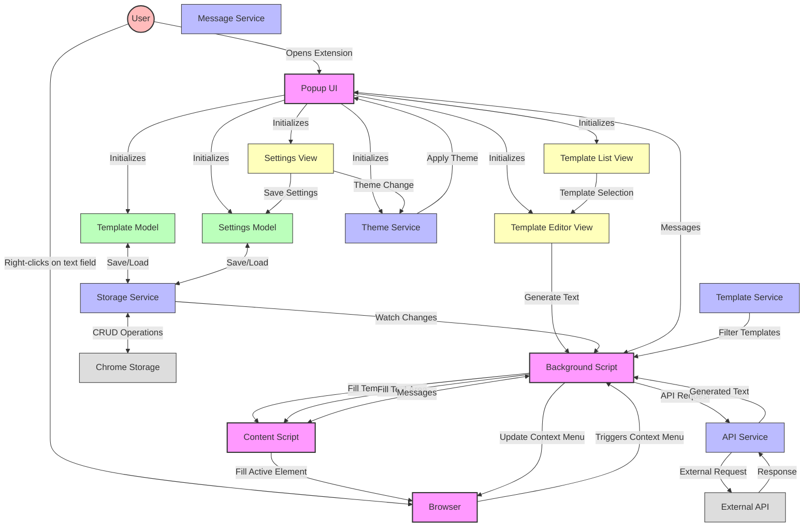

# Foundation Fill Architecture

## Data Flow Description

1. **User Interaction:**
   - User interacts with the extension via the popup interface or context menu
   - Templates are managed through the popup UI
   - Templates are applied through context menu on text fields

2. **Component Communication:**
   - Background script acts as the central coordinator
   - Content script interacts with webpage DOM
   - Popup script manages user interface and settings
   - Chrome storage API stores templates and settings

3. **Template Processing:**
   - Templates are stored with system prompts and user prompts
   - Templates can be domain-specific and filtered accordingly
   - When a template is selected, it can be enhanced with:
     - Page content (optional)
     - API generation (if API key is configured)

4. **External API Integration:**
   - Extension sends template data to configured API
   - Generated text is returned and inserted into the active text field
   - Fallbacks exist for when API is unavailable or errors occur

5. **Event Handling:**
   - Context menu updates when tabs change or templates are updated
   - Settings changes trigger immediate application of preferences
   - Theme changes are applied without page reload

6. **Error Handling:**
   - API errors are displayed to the user
   - Missing configuration shows helpful messages
   - Network issues are gracefully handled with fallbacks