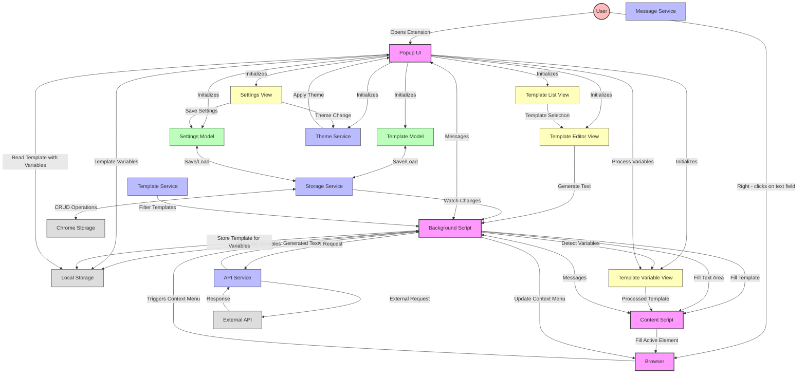

# Foundation Fill Architecture

Foundation Fill implements a modular architecture that combines Model-View patterns with service-oriented design. This
document explains the overall architecture and data flow of the extension.

## Architecture Diagram

## Core Components

### Extension Components

1. **Background Script (`background.ts`)**
   - Acts as the central coordinator for the extension
   - Manages context menu creation and updates
   - Handles messages from the popup and content scripts
   - Coordinates API requests and responses
   - Detects templates with variables and initiates variable resolution

2. **Content Script (`content.ts`)**
   - Runs in the context of web pages
   - Interacts with the web page DOM
   - Fills text fields with template content
   - Manages text generation animation
   - Receives processed templates with resolved variables

3. **Popup UI (`index.ts`, `Popup.ts`)**
   - User interface for managing templates and settings
   - Initializes models and views
   - Handles UI interactions and navigation
   - Processes template variables when triggered by background script

### Models

1. **Template Model (`popup/models/Template.ts`)**
   - Manages template data (system prompts, user prompts)
   - Handles template creation, updating, and deletion
   - Provides domain-specific template filtering
   - Maintains template order and supports reordering
   - Provides template duplication capability
   - Persists templates to storage

2. **Settings Model (`popup/models/Settings.ts`)**
   - Manages user preferences and settings
   - Handles API configuration (key, URL, model)
   - Manages theme settings
   - Persists settings to storage

### Views

1. **Template List View (`popup/views/TemplateList.ts`)**
   - Displays the list of available templates
   - Handles template selection events
   - Manages template deletion and duplication UI
   - Provides drag-and-drop reordering of templates
   - Ensures default template always remains at the top

2. **Template Editor View (`popup/views/TemplateEditor.ts`)**
   - Provides interface for editing templates
   - Handles saving template changes
   - Manages template duplication functionality 
   - Manages domain-specific settings
   - Integrates with template variable processing

3. **Settings View (`popup/views/Settings.ts`)**
   - Interface for editing extension settings
   - Manages API configuration input
   - Handles theme selection

4. **Template Variable View (`popup/views/TemplateVariable.ts`)**
   - Extracts template variables from prompts
   - Provides UI for entering variable values
   - Replaces variables in templates with user input
   - Uses format `{{variable:default value}}` for template variables
   - Maintains dialog UI for variable input collection

### Services

1. **API Service (`generate/api-service.ts`)**
   - Handles communication with external LLM APIs
   - Manages API requests and responses
   - Handles error cases and timeouts

2. **Storage Service (`utils/storage-service.ts`)**
   - Provides abstraction over Chrome storage API
   - Handles serialization and deserialization
   - Manages error handling for storage operations

3. **Theme Service (`popup/views/Theme.ts`)**
   - Manages application theming
   - Handles system theme detection
   - Applies theme changes
   - Uses CSS variables via document.documentElement.style.setProperty
   - Centralized color management with THEME_COLORS as single source of truth

## Data Flow

### Template Creation and Usage Flow

1. **Template Creation and Management**
   - User opens the extension popup
   - User creates/edits a template in TemplateEditor
   - User can reorder templates via drag and drop in TemplateList (with SortableJS)
   - TemplateModel saves the template data and order to StorageService
   - StorageService persists to Chrome Storage
   - Background script is notified of changes
   - Context menu is updated with the new templates in their specified order

2. **Template Usage**
   - User right-clicks on a text field
   - Context menu is displayed with available templates
   - User selects a template
   - Background script checks if template contains variables
   - If no variables, template is sent directly to content script
   - If variables present, popup is opened for variable resolution

### Template Variables Flow

1. **Variable Detection**
   - When user selects a template from context menu
   - Background script scans system and user prompts for variable patterns
   - Variables are identified using the pattern `{{name:default}}`
   - If variables are found, a different process is triggered

2. **Variable Resolution Process**
   - Background stores template in Chrome local storage
   - Background triggers popup to open
   - Popup reads template from local storage
   - Popup displays template editor UI
   - TemplateVariableView extracts all variables
   - TemplateVariableView shows dialog for each variable with default values
   - User inputs custom values for variables
   - Variables are replaced with user-provided values
   - Processed template is sent to content script for insertion

3. **Variable Format**
   - Variables use format `{{variable_name:default_value}}`
   - Default values are optional: `{{variable_name}}`
   - Variables can be used in both system and user prompts
   - Same variable name in multiple locations uses the same value

### Text Generation Flow

1. **Text Generation Request**
   - User selects a template with API generation enabled
   - Variables are processed if present
   - Content script sends generation request to background
   - Background script uses APIService to make external request
   - Animation is displayed while waiting for response
   - Response is received and passed back to content script
   - Content script updates the text field with generated content

### Settings and Theme Flow

1. **Settings Management**
   - User updates settings in the Settings view
   - Settings are passed to SettingsModel
   - SettingsModel updates and persists changes
   - Services that depend on settings are notified

2. **Theme Management**
   - User selects a theme or system uses default
   - User can choose from multiple color schemes (blue, red, green, purple, orange, pink)
   - ThemeService applies theme by setting CSS variables via document.documentElement.style.setProperty
   - THEME_COLORS object serves as single source of truth for all color values
   - UI updates dynamically based on CSS variables

## Error Handling Strategy

1. **API Errors**
   - Network errors are caught and displayed to the user
   - Invalid API keys trigger helpful error messages
   - Timeouts are handled gracefully

2. **Storage Errors**
   - Failed storage operations are logged
   - Default values are used when storage fails
   - Critical errors are reported to the user

3. **Message Passing Errors**
   - Communication errors between components are logged
   - Fallbacks exist for failed communication

4. **Variable Processing Errors**
   - Invalid variable formats are gracefully handled
   - If variable dialog is closed, default values are used
   - Template processing failures fall back to original template

## Performance Considerations

1. **Context Menu Updates**
   - Context menu only updates when templates change
   - Domain-specific filtering reduces menu clutter
   - Templates are displayed in user-specified order

2. **Storage Usage**
   - Data is stored efficiently
   - Templates are serialized appropriately
   - Local storage used for temporary variable resolution data

3. **Animation**
   - Text generation includes animation for user feedback
   - Animations timeout after a configurable period

## Security Considerations

1. **API Key Storage**
   - API keys are stored in Chrome's secure storage
   - Keys are never exposed in the DOM

2. **Content Security**
   - Content script follows proper isolation practices
   - No arbitrary code execution from templates
   - Variables are safely processed without injection risks

3. **Permission Usage**
   - Minimal permissions are requested
   - Each permission has a specific purpose clearly communicated to users