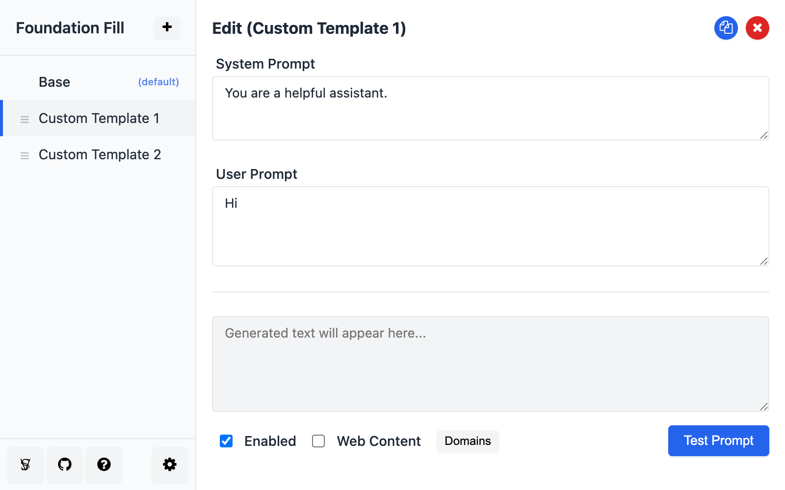

# Foundation Fill

A Chrome extension for filling text fields with predefined system prompt templates and generating text using LLM APIs.

## Overview

Foundation Fill helps you quickly populate text fields with custom templates. It's especially useful for:

- Software engineers creating boilerplate code snippets
- Writers using consistent prompts for AI tools
- Support teams using standardized response templates
- Researchers using specific instructions for AI assistants

## Features

- Create, edit, duplicate, reorder, and manage reusable templates
- Customize system prompts and user prompts
- Domain-specific templates (only appear on specific websites)
- Include page content in prompt generation for contextual responses
- Context menu integration for quick access to templates
- Light/dark/system theme support to match your browser
- Multiple theme color options with consistent styling
- Multilingual support with translations for English, Simplified Chinese, and Traditional Chinese
- Text generation via customizable API integration
- Animation during text generation for better user feedback
- Template variables with custom values - use `{{variable:default}}` syntax in your templates



## Installation

### From Chrome Web Store (Recommended)

1. Visit the [Chrome Web Store page](https://chrome.google.com/webstore/detail/foundation-fill/TBD) (Coming soon)
2. Click "Add to Chrome"
3. Accept the permissions when prompted

### From GitHub Releases

1. Visit the [GitHub Releases page](https://github.com/Vivswan/FoundationFill/releases)
2. Download the latest release zip file
3. Extract the zip file to a folder
4. Go to `chrome://extensions/`
5. Enable Developer mode
6. Click "Load unpacked" and select the extracted folder

### Manual Installation (Development)

1. Clone the repository or download the source code
2. Follow the development setup instructions below
3. Load the extension in Chrome's developer mode

## Usage

1. **Create Templates**: Open the extension popup and create templates with system prompts and user prompts
2. **Use Templates**: Right-click on any text field while browsing and select your template from the context menu
3. **Organize Templates**: Reorder templates by dragging and dropping using the handle icon (default template always
   stays at the top). Easily duplicate templates with the copy button for quick variations.
4. **Domain-Specific Templates**: Set templates to only appear on specific websites using wildcards like `*.example.com`
5. **Generate Text**: Configure API settings to use an LLM for generating content based on your templates
6. **Use Template Variables**: Add variables like `{{name:John}}` in your templates and you'll be prompted to provide
   values when using the template. The format is `{{variable_name:default_value}}` where the default value is optional.
7. **Import/Export Templates**: Share your templates with others or back them up using the import/export functionality
8. **Theme Customization**: Choose from light, dark, or system theme with multiple color options

## Project Structure

```
foundation-fill/
├── scripts/               # Build scripts and configuration
│   ├── bun.config.js      # Bun build configuration
│   ├── generate-icons.js  # Script to generate PNG icons from SVG
│   └── bump-version.js    # Script to handle version bumping
├── src/                   # Source code
│   ├── assets/            # Static assets (CSS, images, js)
│   │   ├── css/           # Stylesheet files
│   │   ├── html/          # HTML files for help pages
│   │   ├── images/        # Images and screenshots
│   │   └── js/            # JavaScript utilities
│   ├── background.ts      # Background service worker
│   ├── content.ts         # Content script for web page interaction
│   ├── defaults.ts        # Default settings and templates
│   ├── generate/          # Text generation functionality
│   ├── localization/      # Translations and language support
│   ├── popup/             # Popup UI components
│   │   ├── models/        # Data models
│   │   └── views/         # UI components
│   └── utils/             # Utility functions and services
├── .github/workflows/     # GitHub Actions workflows for CI/CD
├── manifest.json          # Extension manifest
└── tsconfig.json          # TypeScript configuration
```

## Development

### Prerequisites

- [Node.js](https://nodejs.org/) (v18 or later)
- [Bun](https://bun.sh/) for faster builds
- Chrome/Chromium browser

### Setup

1. Clone the repository
   ```bash
   git clone https://github.com/Vivswan/FoundationFill.git
   cd FoundationFill
   ```

2. Install dependencies
   ```bash
   npm install
   ```

3. Build the extension
   ```bash
   npm run build
   ```

4. Load the unpacked extension from the `dist` directory in Chrome:
    - Go to `chrome://extensions/`
    - Enable Developer mode
    - Click "Load unpacked" and select the `dist` directory

### Commands

- `npm run build` - Build the extension using Bun
- `npm run dev` - Start development mode with file watching
- `npm run lint` - Run ESLint linting
- `npm run typecheck` - Run TypeScript type checking
- `npm run generate-icons` - Generate PNG icons from SVG source

### Build System

Foundation Fill uses Bun for fast, efficient builds:

- **Fast Builds**: Bun compiles TypeScript much faster than traditional bundlers
- **Development Mode**: `npm run dev` watches for file changes and rebuilds automatically
- **Automatic Asset Handling**: CSS and images are automatically copied to the dist folder
- **Icon Generation**: SVG icons are automatically converted to PNG in multiple resolutions

## Architecture

The project follows a Model-View architecture with service-oriented components. See [architecture.md](architecture.md)
for a detailed diagram and explanation.

- **Models**: Handle data and business logic (Template, Settings)
- **Views**: Render the UI and handle user interactions
- **Services**: Provide reusable functionality (Storage, API, Theme)
- **Background Script**: Handles context menu, API calls, and messaging
- **Content Script**: Fills text fields and manages text insertion

## Contributing

Contributions are welcome! Please feel free to submit a Pull Request.

1. Fork the repository
2. Create your feature branch (`git checkout -b feature/amazing-feature`)
3. Commit your changes (`git commit -m 'Add some amazing feature'`)
4. Push to the branch (`git push origin feature/amazing-feature`)
5. Open a Pull Request

## License

MIT